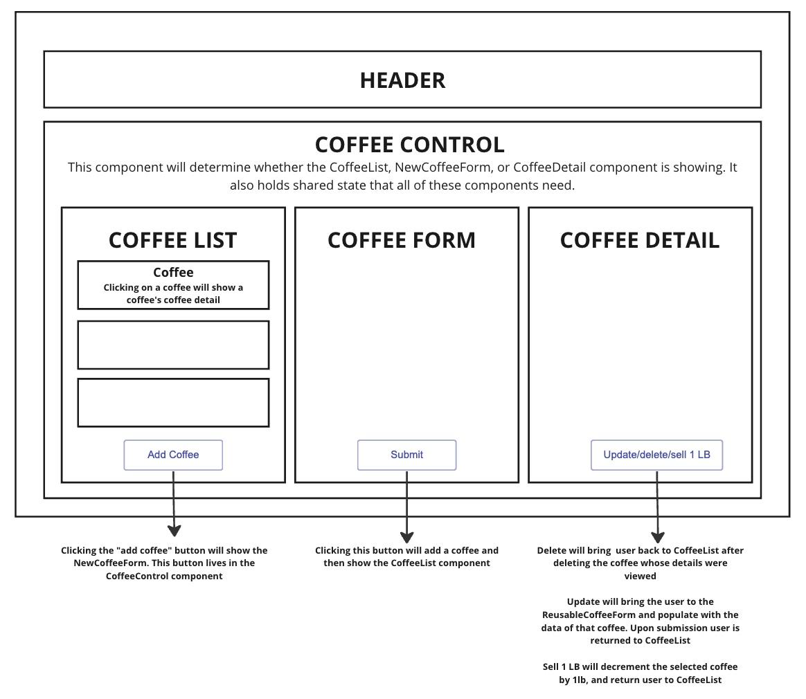

# _Keith's Joe_

#### By _Paul LeTourneau_

#### _Inventory management system for a coffee shop_

## Technologies Used

- _JavaScript_
- _HTML_
- _CSS_
- _Node.js v18.17.1_
- _NPM v9.6.7_
- _React_
- _JSX_
- _PropTypes_

## Description

_Inventory Management system for a coffee shop called Keith's Joe. Allows a user to add a large 130lb bag of coffee and decrement in amounts of 1lb. Can also edit and delete entries for monthly inventory_

## Component Diagram



## Setup/Installation Requirements

- _$ git clone (link)_
- _$ cd FileName_
- _$ npm install_
- _$ npm run build_
<!-- - _$ npm run lint_ -->
- _$ npm run start (see note)_

_{While in the root directory of the project, run `$npm install`.}_

_{If you would like to start a server when UI is added, `$ npm run start`, will open a server in your browser.}_

## Known Bugs

- _Any known issues_
- _should go here_

## License

_{Let people know what to do if they run into any issues or have questions, ideas or concerns. Encourage them to contact you or make a contribution to the code.}_

MIT License

```
Permission is hereby granted, free of charge, to any person obtaining a copy of this software and associated documentation files (the "Software"), to deal in the Software without restriction, including without limitation the rights to use, copy, modify, merge, publish, distribute, sublicense, and/or sell copies of the Software, and to permit persons to whom the Software is furnished to do so, subject to the following conditions:

The above copyright notice and this permission notice shall be included in all copies or substantial portions of the Software.

THE SOFTWARE IS PROVIDED "AS IS", WITHOUT WARRANTY OF ANY KIND, EXPRESS OR IMPLIED, INCLUDING BUT NOT LIMITED TO THE WARRANTIES OF MERCHANTABILITY, FITNESS FOR A PARTICULAR PURPOSE AND NONINFRINGEMENT. IN NO EVENT SHALL THE AUTHORS OR COPYRIGHT HOLDERS BE LIABLE FOR ANY CLAIM, DAMAGES OR OTHER LIABILITY, WHETHER IN AN ACTION OF CONTRACT, TORT OR OTHERWISE, ARISING FROM, OUT OF OR IN CONNECTION WITH THE SOFTWARE OR THE USE OR OTHER DEALINGS IN THE SOFTWARE.

Copyright (c) _2023_ _author name(s)_
```
